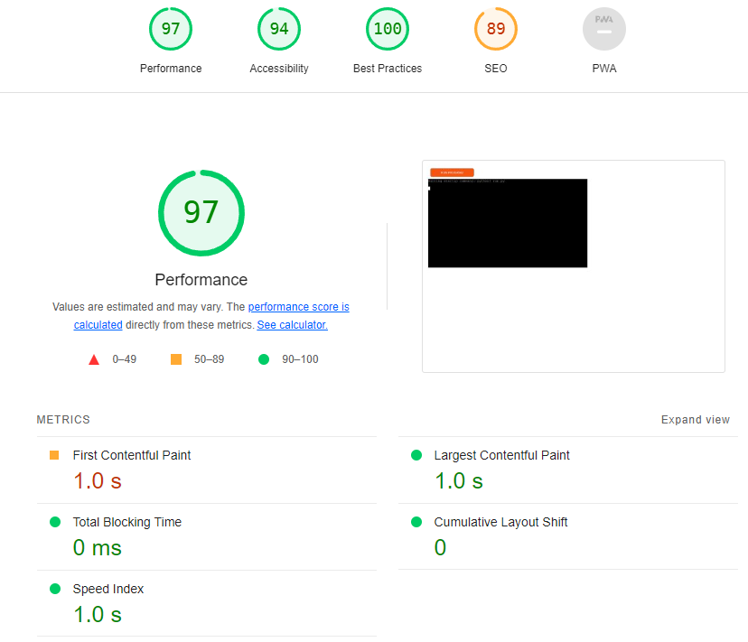
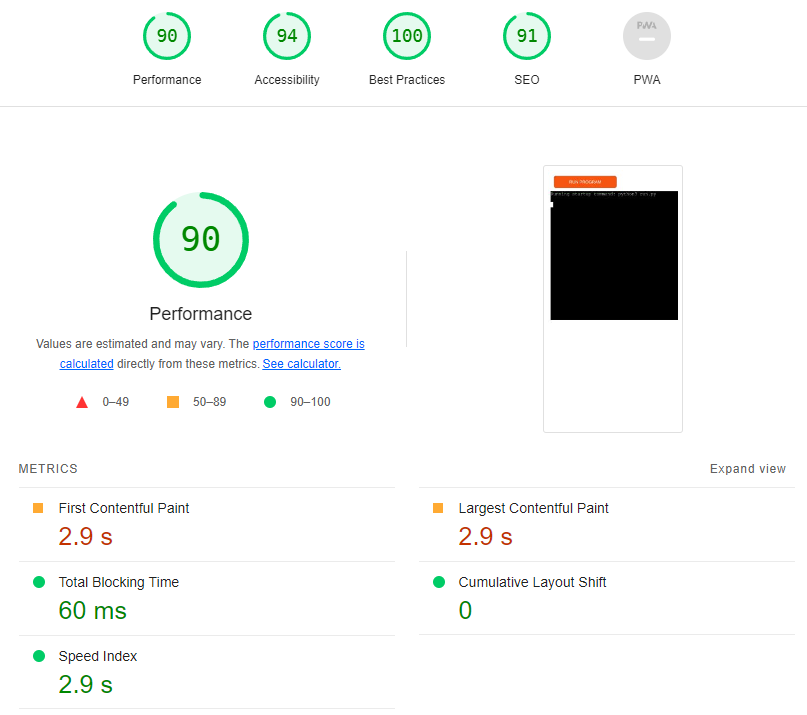

# Stock Trace

View the app here: [Stock Trace](https://stock-trace-8ceccf662779.herokuapp.com/)\
View Google Sheets here: [Google Sheets](https://docs.google.com/spreadsheets/d/1qIUw4Cs-FAEzoi18zY4VcJ_trZYqNWqI5AYZb930VtA/edit?usp=sharing)

## Intro

- The purpose of this project is to create a fully functional back-end site that responds to users' interactions. In this case I have created a Command Line Interface (CLI) called 'Stock Trace', using Python. This application is designed for a method of adding, removing and monitoring stock levels, specifically food items/ingredients in this case. This application is designed more for large industrial type kitchens such as in a hospital, or a factory canteen. The reason for this is that in these environments, there is a better idea of the amount of food required so items can be signed out on the previous evening according to the menu for the next day.

- Current stock levels of food items from can be viewed in real time.
- New stock can be added to the relevant section when a delivery arrives. Unused items can also be added back to the inventory lists and is safe to do so.

- The stock levels can also be monitored by persons outside of the physical kitchen, such as the kitchen manager and accounts.

## User Stories

- As a user, I would like to be able to check my current stock levels.
- As a user, I would like to be able to add to my stock levels when deliveries arrive.
- As a user, I would like to be able to remove items from the available stock when required.
- As a user, I would like to see these changes to stock levels reflected in the related Google Sheets.
- As a user, I would like to be able to easily navigate the menus, and be notified if I have made incorrect choices.

## Features

### Menu Options 
  
**Main Menu**\
The Main Menu consists of three options:
1. The user can proceed to the Current Stock Menu by inputting 1 & Enter.
2. The user can proceed to the Input New Items Menu by inputting 2 & Enter.
3. The user can proceed to the Use Stock Menu by inputting 3 & Enter.

\
    
    

**Current Stock Menu**\
The Current Stock Menu Consists of six options:
1. The user can proceed to view the Meat & Fish stock list by inputting 1 & Enter.
2. The user can proceed to view the Fruit& Veg stock list by inputting 2 & Enter.
3. The user can proceed to view the Dry Goods stock list by inputting 3 & Enter.
4. The user can proceed to view the Chilled Goods list by inputting 4 & Enter.
5. The user can proceed to view the Frozen Items by inputting 5 & Enter.
6. The user can return to the Main Menu by inputting 6 & Enter.

    

**Current Stock List screens**

The Current Stock lists show the user the name, weight/volume, and current amount of each item held in stock as per Google Sheets.

- Meat & Fish list. Pressing Enter returns to the Current Stock menu.

- Fruit & Veg list. Pressing Enter returns to the Current Stock menu.

- Dry Goods list. Pressing Enter returns to the Current Stock menu.

- Chilled Goods list. Pressing Enter returns to the Current Stock menu.

- Chilled Goods list. Pressing Enter returns to the Current Stock menu.

\

**Input New Items**

- The Input New Items menu displays the same 

**Use Stock Items**

- When the puzzle is solved, a pop-up message will congratulate you for solving the puzzle and let you know how many moves you made.

### The Footer

- The footer section includes links to the relevant social media sites for the puzzle. The links will open to a new tab to allow easy navigation for the user.
- The footer is valuable to the user as it encourages them to keep connected via social media.

    

## Future Features

- Future features will include recording of high scores, an audio alert when you complete the game (if audio is enabled), 

    
    

## Flowchart

   

## Technology Used

### Language Used

- HTML5 & JavaScript were provided as part of the Code Institute template for this project.
- Python was the language I used to write my code for this project.

### Programs, Libraries & Frameworks Used

- Google Sheets was used for the storage of data used in this application.
- VS Code Desktop was used to write the code.
- Gitpod was used for 
- Lucidchart was used to create the flowchart provided.
- 
- Figma was used to design the wireframe for the project.
- Github was used to store the project code after being pushed.

## Testing

- CI Python Linter

- Lighthouse Desktop

- Lighthouse Mobile

- 

### Known Bugs

- 

## Deployment

- 

## Credits

**During this project I used:**
- 

## Acknowledgements

- Friends, family and colleagues, for testing my project at every stage, and also for their feedback.
- My Mentor for constructive feedback and direction.
- Support from The Code Institute.
