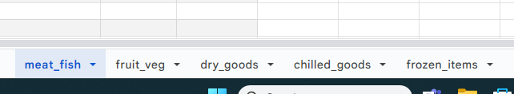

# Stock Trace

View the app here: [Stock Trace](https://stock-trace-8ceccf662779.herokuapp.com/)\
View Google Sheets here: [Google Sheets](https://docs.google.com/spreadsheets/d/1qIUw4Cs-FAEzoi18zY4VcJ_trZYqNWqI5AYZb930VtA/edit?usp=sharing)

## Intro

- The purpose of this project is to create a fully functional back-end site that responds to users' interactions. In this case I have created a Command Line Interface (CLI) called 'Stock Trace', using Python. This application is designed for a method of adding, removing and monitoring stock levels, specifically food items/ingredients in this case. This application is designed more for large industrial type kitchens such as in a hospital, or a factory canteen. The reason for this is that in these environments, there is a better idea of the amount of food required so items can be signed out on the previous evening according to the menu for the next day.

- Current stock levels of food items from can be viewed in real time.
- New stock can be added to the relevant section when a delivery arrives. Unused items can also be added back to the inventory lists and is safe to do so.

- The stock levels can also be monitored by persons outside of the physical kitchen, such as the kitchen manager and accounts.

## User Stories

- As a user, I would like to be able to check my current stock levels.
- As a user, I would like to be able to add to my stock levels when deliveries arrive.
- As a user, I would like to be able to remove items from the available stock when required.
- As a user, I would like to see these changes to stock levels reflected in the related Google Sheets.
- As a user, I would like to be able to easily navigate the menus, and be notified if I have made incorrect choices.

## Features

### Menu Options 
  
**Main Menu**\
The Main Menu consists of three options:
1. The user can proceed to the Current Stock Menu by inputting 1 & Enter.
2. The user can proceed to the Input New Items Menu by inputting 2 & Enter.
3. The user can proceed to the Use Stock Menu by inputting 3 & Enter.

    
   

**Current Stock Menu**
The Current Stock Menu Consists of six options:
1. The user can proceed to view the Meat & Fish stock list by inputting 1 & Enter.
2. The user can proceed to view the Fruit& Veg stock list by inputting 2 & Enter.
3. The user can proceed to view the Dry Goods stock list by inputting 3 & Enter.
4. The user can proceed to view the Chilled Goods list by inputting 4 & Enter.
5. The user can proceed to view the Frozen Items by inputting 5 & Enter.
6. The user can return to the Main Menu by inputting 6 & Enter.

    
 

**Current Stock List screens**

The Current Stock lists show the user the name, weight/volume, and current amount of each item held in stock as per Google Sheets.

- Meat & Fish list. Pressing Enter returns to the Current Stock menu.

 

- Fruit & Veg list. Pressing Enter returns to the Current Stock menu.

 

- Dry Goods list. Pressing Enter returns to the Current Stock menu.

 

- Chilled Goods list. Pressing Enter returns to the Current Stock menu.

 

- Chilled Goods list. Pressing Enter returns to the Current Stock menu.

 

**Input New Items**

- The Input New Items menu displays the same five list options, and a sixth option to return to the previous menu. A menu choice is made by enterning the relevant number selection and pressing Enter.

 

- Input New Items screen. User is prompted input name of an existing stock item from the category they have currently selected, then press Enter to confirm. After that the user is prompted to enter the amount they wish to add, then press Enter to confirm. If the inputs are successful, the user will be give a confirmation message indicating what was added, how much was added, and the new stock level.

 

**Use Stock Items**

- The Use Stock Items menu displays the same six options, five categories and a sixth option to return to the previous menu. The user should input the relevant number and press Enter to confirm.

 

- Use Stock Items screen. User is prompted input name of an existing stock item from the category they have currently selected, then press Enter to confirm. After that the user is prompted to enter the amount they wish to use, then press Enter to confirm. If the inputs are successful, the user will be give a confirmation message indicating what was checked out, how much was checked out, and the new stock level.

 

**Google Sheets**

- The data used in the lists is stored in Google Sheets. The data updates when the user either adds or removes stock from the list. In this case the units of weight/volume remain the same. This is relevant to the real world example of a purchase order being in place with the supplier to provide the same unit of stock each time an order is made.

 

- The data categories relevant to the menu categories displayed in the app are shown here separated into real-world sections. The sections are divided this way as to be more intuitive to the user to find the required menu option. 

 

## Future Features

The possible future features with this application are:
- Connecting this app to a well presented front-end display with dropdown menus and/or predictive text for item entry to speed up the entry process and reduce the possible amout of errors in entering stock item names. This app would be accessed though a designated tablet device which would make it portable.
- A user login for each person authorized to use the app. Also, an administrator account.
- Logging of ingoing/outgoing stock which contains dates, times, and person involved.
- Recording food wastage at the end of day.
- Recording of cooking times, food temperature, and fridge temperatures. This feature will reduce the amount of paper used, and comply with HACCP kitchen safety regulations. 
- The administrator can add/remove items from the list according to menu changes and availability, also change the weight/volume of a unit of the item. This is currently only possible by editing directly through Google Sheets.
- An alert message can be displayed when items go below a set amount to prompt the user to place a new order.

## Flowchart

   

## Technology Used

### Language Used

- HTML5 & JavaScript were provided as part of the Code Institute template for this project.
- Python was the language I used to write my code for this project.

### Programs, Libraries & Frameworks Used

- Google Sheets was used for the storage of data used in this application.
- VS Code Desktop was used to write the code.
- Gitpod was used for 
- Lucidchart was used to create the flowchart provided.
- 
- Figma was used to design the wireframe for the project.
- Github was used to store the project code after being pushed.

## Testing

- I validated my code using the Code Institute Python Linter. The final testing shows a result of no errors or warnings. 

 

### Test Cases: 

- When a user makes an invalid input in the main menu, they are notified with an error message. They are then prompted to re-enter a selection within the parameters shown. As seen below, the error message is shown because of a string being entered instead of the required numerical input. 

 

- When a user makes an invalid input in the current stock menu, they are notified with an error message. They are then prompted to re-enter a selection within the parameters shown. As seen below, the error message is shown because of a out of range number being input. This number is also a negative, which is not accepted.

 

- When a user makes an invalid input in the input new items menu, they are notified with an error message. They are then prompted to re-enter a selection within the parameters shown. As seen below, the error message is shown because of an out of range number being input. 

 

- When a user makes an invalid input in the input new items menu, they are notified with an error message. They are then prompted to re-enter a selection within the parameters shown. As seen below, the error message is shown because of a negative value being input.

 

- When a user makes an invalid input in the input new items menu, they are notified with an error message. They are then prompted to re-enter a selection within the parameters shown. As seen below, the error message is shown because of a valid stock item being input to the wrong Google Sheets category list. 

 

- When a user makes an invalid input in the use stock items menu, they are notified with an error message. They are then prompted to re-enter a selection within the parameters shown. As seen below, the error message is shown because of an attempt to check out more stock than is available at that time. 

 

- When a user makes an invalid input in the use stock items menu, they are notified with an error message. They are then prompted to re-enter a selection within the parameters shown. As seen below, the error message is shown because of a string being entered instead of a numerical input. 

 

- All of these test cases have been tested on all menus and item name/amount inputs across the app without encountering any issues. 

### Known Bugs

- I noticed that some of the current stock lists appeared to be not clearing when I deployed the project with Heroku. I altering my code several times without success. After contacting Tutor Support, I was informed that the lists that were appearing to not be cleared were longer than the the live console window, and only the visible data was being cleared. The issue lies with the CI template that was used for this project. For the purposes of this project, I have shortened my current stock lists to all fit inside the console window. 

- 

## Deployment

- 

## Credits

**During this project I used:**
- 

## Acknowledgements

- Friends, family and colleagues, for testing my project at every stage, and also for their feedback.
- My Mentor for constructive feedback and direction.
- Support from The Code Institute.
